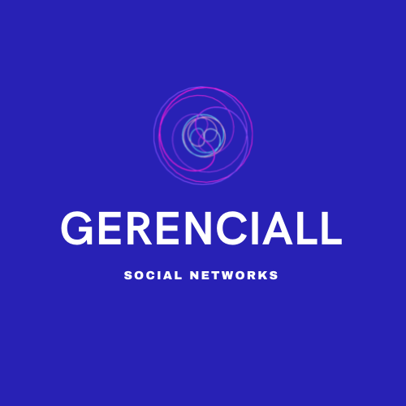

# GERENCIADOR DE REDES SOCIAIS

`CURSO`Análise e Desenvolvimento de Sistemas

`DISCIPLINA`Projeto: Desenvolvimento de aplicação Web Front-End

`SEMESTRE`Eixo 1

O objetivo deste trabalho é fornecer uma plataforma de integração de redes sociais e gestão de resultados, onde será possível gerenciar os canais de comunicação para facilitar o contato afim de alavancar e prosperar uma venda ou alcance da marca.

## Integrantes

* Gabriel Eduardo Palhares
* Gustavo dos Anjos Mendes Costa
* Kenia Maria da Cunha

## Orientador

* Sandra Maria Silveira

## Instruções de utilização

Acessar o endereço https://gustavocostamarketing.github.io/gerenciall/, realizar o login da rede social que deseja e adicionar as informações da publicação.

# Documentação

<ol>
<li><a href="docs/01-Documentação de Contexto.md"> Documentação de Contexto</a></li>
<li><a href="docs/02-Especificação do Projeto.md"> Especificação do Projeto</a></li>
<li><a href="docs/03-Metodologia.md"> Metodologia</a></li>
<li><a href="docs/04-Projeto de Interface.md"> Projeto de Interface</a></li>
<li><a href="docs/05-Arquitetura da Solução.md"> Arquitetura da Solução</a></li>
<li><a href="docs/06-Template padrão do Site.md"> Template padrão do Site</a></li>
<li><a href="docs/07-Programação de Funcionalidades.md"> Programação de Funcionalidades</a></li>
<li><a href="docs/08-Plano de Testes de Software.md"> Plano de Testes de Software</a></li>
<li><a href="docs/09-Registro de Testes de Software.md"> Registro de Testes de Software</a></li>
<li><a href="docs/10-Apresentação do Projeto.md"> Apresentação do Projeto</a></li>
<li><a href="docs/11-Referências.md"> Referências</a></li>
</ol>

# Código

<li><a href="src/README.md"> Código Fonte</a></li>

# Apresentação

<li><a href="presentation/README.md"> Apresentação da solução</a></li>
