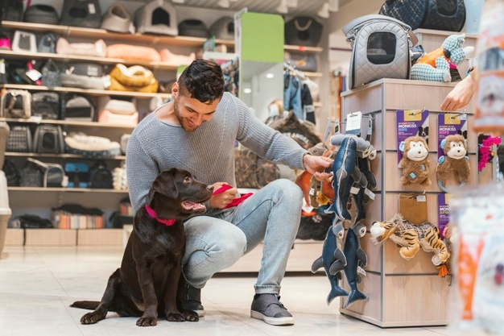

# Especificações do Projeto

Pré-requisitos: <a href="1-Documentação de Contexto.md"> Documentação de Contexto</a>

Por meio da vivência e dificuldades expostas pelos usuários das redes sociais comerciais foi definido pelo grupo o problema a ser solucionado e seus relevantes pontos a serem considerados. Os detalhes apresentados nesse processo foram consolidados no modo de personas e histórias de usuários. 

## Personas
<<<<<<< HEAD
<<<<<<< Updated upstream
|------------------------|------------------------------------|---------------------------------------|
=======

<<<<<<< Updated upstream
>>>>>>> Stashed changes

|------------------------|------------------------------------|---------------------------------------|
|                        | Idade: 65                          | Aplicativos:                          |
|      JOÃO PEDRO        | Ocupação:Proprietário de uma       |  * WhatsApp                           |
|                        | pequena papelaria no seu bairro    |                                       |
-------------------------|------------------------------------|---------------------------------------|
|Motivações:             |Frustações:                         | Hobbies                               |
| * O sustento e melhoria|* João tem medo de ser dominado pelo| * Pescaria, Jogos de Futebol e Bar    |
| de vida da sua família |mundo tecnologico e ficar para trás |  com os amigos                        |
|                        |                                    |                                       |
|                        |                                    |                                       |
|------------------------|------------------------------------|---------------------------------------|
=======

Pedro Paulo tem 26 anos, é arquiteto recém-formado e autônomo. Pensa em se desenvolver profissionalmente através de um mestrado fora do país, pois adora viajar, é solteiro e sempre quis fazer um intercâmbio. Está buscando uma agência que o ajude a encontrar universidades na Europa que aceitem alunos estrangeiros.

>>>>>>> Stashed changes
=======
>>>>>>> main

|      | **JOÃO PEDRO**                                                        | | 
|------|----------------------------------------------------------------------------------------------|------------|
|* Ocupação: proprietário de uma pequena papelaria no seu bairro.       | * Idade: 65                        | * Aplicativos: WhatsApp | 
|  * Motivações: O sustento e melhoria de vida da sua família | * Frustrações: João tem medo de ser dominado pelo mundo tecnológico e ficar para trás.  | * Hobbies: Pescaria, Jogos de Futebol e Bar com os amigos.      |

|      | **JULIANA**                                                                                 |   |          
|------|----------------------------------------------------------------------------------------------|------------|
| * Ocupação: proprietária de uma loja de roupas infantil.       | * Idade: 50                     | * Aplicativos: WhatsApp, Facebook, Instagram| 
|  * Motivações: Inovar e crescer no ramo da moda infantil  | * Frustrações: Medo de perder mercado para as grandes redes e lojas de roupa.  | * Hobbies: Culinária, academia e passeios 

|       | **DIEGO**                                                                                |     |        
|------|----------------------------------------------------------------------------------------------|------------|
| * Ocupação: proprietário de um Pet Shop      | * Idade: 25                             | * Aplicativos: WhatsApp, Facebook, Instagram, Twitter, Youtube| 
| * Motivações: Crescer e expandir sua loja no mercado pet.   | * Frustrações: Perder mercado para grandes redes de Pet Shop como, Petz, Cobasi entre outras. | * Hobbies: Esportes, Viagens, Filmes e vídeos de diversos conteúdo. 

<<<<<<< HEAD

|EU COMO... `PERSONA`| QUERO/PRECISO ... `FUNCIONALIDADE`         |PARA ... `MOTIVO/VALOR`                 |
|--------------------|--------------------------------------------|----------------------------------------|
|João Pedro          | Ingressar minha loja nas redes sociais;    | Obter mais clientes, que foram perdidos|
|                    | Conseguir realizar postagens sobre produtos| com a chegada das lojas digitais.      |
|                    | de maneira personalizada;                  |                                        |
|                    | Quer orientação para usar a plataforma;    |                                        |
|--------------------| -------------------------------------------|----------------------------------------|
|Juliana             | Verificar o engajamento de suas publicações| Conectar clientes e conseguir crescer  |
|                    | nas suas redes sociais de uma forma simples| no ramo da moda infantil               |
|                    |                                            |                                        |
|--------------------| -------------------------------------------|----------------------------------------|
|Diego               | Um local único que integre todas as redes  | Ampliar seus canais de vendas e        |
|                    | socias;                                    | divulgação dos serviços e produtos em  |
|                    | Ter um calendário de publicações;          | busca de crescimento do empresa nas    |
|                    |                                            | redes sociais.                         |
|--------------------| -------------------------------------------|----------------------------------------|
|Luiza               | Alavancar sua identidade visual;           | Aumentar a receita via canais digitais |
|                    | Escalabilidade das suas redes sociais      | e pontecializar seu marketing.         |
|                    | atingindo um grande número de clientes;    |                                        |
|                    | Aumentar o seu ramo de atividades.         |                                        |
|--------------------| -------------------------------------------|----------------------------------------|

Quer orientação para usar a plataforma           | Não esquecer de fazê-las               |
|Administrador       | Alterar permissões                 | Permitir que possam administrar contas |
=======
|       | **LUIZA**                                                                         |         |            
|------|----------------------------------------------------------------------------------------------|------------|
| * Ocupação: Trabalha em uma empresa de vendas de artigos de madeira ornamentais.  | * Idade: 27    * Aplicativos: WhatsApp, Facebook, Instagram, Twitter, Youtube, Pinterest | 
| * Motivações: Almejar uma ascensão de vendas nos segmentos de design, arquitetura, workshops que seguem as mesmas linhas de raciocínio.   | * Frustrações: Não conseguir alcançar uma quantidade de clientes necessários e, por conseguinte não estar de acordo com as metas de caráter financeiro e obrigatórios da empresa.   | * Hobbies: Leitura, viagens, exposições culturais e artísticas. 
 

>>>>>>> main

<<<<<<< HEAD
=======

## Histórias de Usuários

|EU COMO... `PERSONA`| QUERO/PRECISO ... `FUNCIONALIDADE`         |PARA ... `MOTIVO/VALOR`                 |
|--------------------|--------------------------------------------|----------------------------------------|
|João Pedro          | Ingressar minha loja nas redes sociais;        | Obter mais clientes, que foram perdidos com a chegada das lojas digitais. |
|                    | Conseguir realizar postagens sobre produtos de maneira personalizada;   |           |
|                    | Quer orientação para usar a plataforma;    |                                        |
|Juliana             | Verificar o engajamento de suas publicações nas suas redes sociais de uma forma simples| Conectar clientes e conseguir crescer no ramo da moda infantil|
|Diego               | Um local único que integre todas as redes socias; | Ampliar seus canais de vendas e divulgação dos serviços e produtos em busca de crescimento da empresa nas redes sociais.       |
|                    | Ter um calendário de publicações;          |     |
|Luiza               | Alavancar sua identidade visual;           | Aumentar a receita via canais digitais e pontecializar seu marketing. |
|                    | Escalabilidade das suas redes sociais atingindo um grande número de clientes;      |          |
|                    | Aumentar o seu ramo de atividades.         |                                        |

>>>>>>> main

## Requisitos

Ao começar um projeto todos os requisitos devem ser levantados, entendidos e documentado. O escopo deste projeto é definido por meio de requisitos funcionais, que são as características que definem os critérios de aceitação do produto e a necessidade do cliente, e requisitos não funcionais que é voltado pelas características de qualidade que o sistema todo ou uma funcionalidade em específico deve ter. A seguir estes requisitos são apresentados. 

### Requisitos Funcionais

<<<<<<< HEAD
A tabela a seguir apresenta os requisitos do projeto, identificando a prioridade em que os mesmos devem ser entregues. 

|ID    | Descrição do Requisito  | Prioridade |
|------|-----------------------------------------|----|
|RF-001| Permitir que o usuário cadastre tarefas | ALTA | 
|RF-002| Emitir um relatório de tarefas no mês   | MÉDIA |

=======
|ID    | Descrição do Requisito                                                                       | Prioridade |
|------|----------------------------------------------------------------------------------------------|------------|
|RF-001| O site deve apresentar uma plataforma de integração com redes sociais obtidas por meio de API| ALTA       | 
|RF-002| O site deve permitir incluir/excluir/alterar contas de redes sociais.                        | MÉDIA      |
|RF-003| O site deve permitir agendar postagens nas redes sociais.                                    | MÉDIA      |
|RF-004| O site deve permitir fazer login com a conta da rede social.                                 | ALTA       |
|RF-005| O site deve permitir o gerenciamento de anúncios nas redes sociais                           | MÉDIA      |
|RF-006| O site deve ter um calendário para acompanhar os agendamentos.                               | MÉDIA      |
|RF-007| O site deve apresentar um relatório de dados das redes sociais                               | BAIXA      |
|RF-008| O site deve apresentar uma API de criação de posts.                                          | BAIXA      |
|RF-009| O site deve apresentar dicas de marketing digital.                                           | BAIXA      |
|RF-010| O site deve apresentar um guia de utilização.                                                | BAIXA      |
>>>>>>> main

### Requisitos não Funcionais

|ID     | Descrição do Requisito  |Prioridade |
|-------|-------------------------|----|
|RNF-001| O site deve ser publicado em um ambiente acessível publicamente na Internet (Repl.it, GitHub Pages, Heroku);  | ALTA | 
|RNF-002| O site deverá ser responsivo permitindo a visualização em um celular de forma adequada |  ALTA | 
|RNF-003| O site deve ter bom nível de contraste entre os elementos da tela em conformidade |  MEDIA |
|RNF-004| O site deve ser apresentado de maneira fácil e interativa para o usuário.|  ALTA |
|RNF-005| O site deve ser compatível com os principais navegadores do mercado (Google Chrome, Firefox, Microsoft Edge) |  ALTA |

## Restrições

|ID| Restrição                                             |
|--|-------------------------------------------------------|
|RE-01| O projeto deverá ser entregue no final do semestre letivo, não podendo extrapolar a data de 06/12/2021.|
|RE-02| O aplicativo deve se restringir às tecnologias básicas da Web no Frontend      |
|RE-03| A equipe não pode subcontratar o desenvolvimento do trabalho.      |

