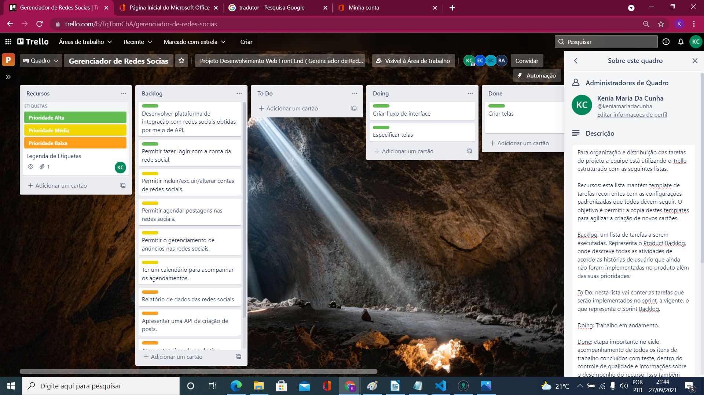
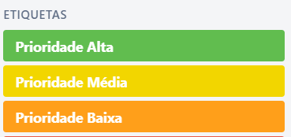

# Metodologia

Pré-requisitos: <a href="2-Especificação do Projeto.md"> Documentação de Especificação</a>

A metodologia contempla os procedimentos a serem adotados pela equipe, neste item deve ser descrito como o projeto será realizado para o cumprimento e manutenção dos objetivos propostos e mencionado os artefatos para a organização e execução das tarefas no projeto.

## Relação de Ambientes de Trabalho

|              Ambiente              |   Plataforma   |      Link de Acesso       |
|------------------------------------|----------------|---------------------------|
| Repositório de código fonte        | GitHub         | https://bityli.com/9YrCdW |
| Documentos do projeto              | Documento Word | https://bityli.com/dLNHHu |
| Projeto de Interface e  Wireframes | Marvelapp      | https://bityli.com/E5k2iY |
| Gerenciamento do Projeto           | Trello         | https://bityli.com/3GnQIg |

## Gestão de código fonte

O grupo usa o Git Classroom para gestão do código fonte. Link para o diretório: https://bityli.com/OIQ7Qv

## Gerenciamento do Projeto

Como metodologia a equipe definiu uma abordagem de gerenciamento de projetos baseada na metodologia ágil, o SCRUM. 

A equipe está organizada da seguinte maneira:

* Scrum Master: Gustavo dos Anjos Mendes Costa
* Product Owner: Rafael de Abreu Oliveira
* Equipe de Desenvolvimento
    * Kênia Maria da Cunha 
    * Erica Couto Rocha Cicero
* Equipe de Design: Gabriel Eduardo Palhares

Para uma melhor organização e distribuição das atividades do projeto, a equipe está utilizando o Trello estruturado com as seguintes listas:

* Recursos: esta lista mantém template de tarefas recorrentes com as configurações padronizadas que todos devem seguir. O objetivo é permitir a cópia destes templates para agilizar a criação de novos cartões. 

* Backlog: uma lista de tarefas a serem executadas. Representa o Product Backlog, onde descreve todas as atividades de acordo as histórias de usuário que ainda não foram implementadas no produto além das suas prioridades. 

* To Do: nesta lista vai conter as tarefas que serão implementados no sprint, a vigente, o que representa o Sprint Backlog.  

* Doing: Trabalho em andamento. 

* Done: etapa importante no ciclo, acompanhamento de todos os itens de trabalho concluídos com teste, dentro do controle de qualidade e informações sobre o desempenho do recurso. Isso também envolve acompanhamentos com clientes e está pronto para entrega. 

* Blocked: quando há algum impedimento na conclusão da tarefa, ela é movida para esta lista, é muito importante deixar um comentário ou anexo com as informações sobre o motivo do bloqueio. 

O quadro do grupo no Trello está disponível através da URL https://bityli.com/gjzzRC e é apresentado, na figura 1.

Figura 1 – Quadro do Trello

A tarefas são etiquetadas de acordo com a real necessidade e prioridade e estão estabelecidas no seguinte esquema de cores/categorias:  

* Prioridade Alta/ Prioridade Média/ Prioridade Baixa

Figura 2 – Etiquetas do Trello