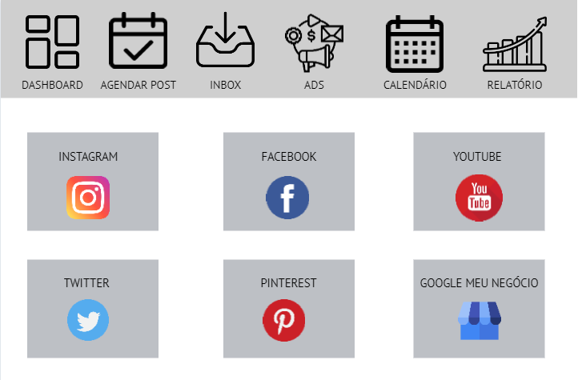

# Projeto de Interface

Um projeto de interface envolve o desenvolvimento de protótipos de interfaces. Alguns elementos, tais como usabilidade, consistência, navegabilidade, interatividade, clareza, flexibilidade, funcionalidade e legibilidade, devem ser considerados no processo de produção dessas interfaces. 

## Fluxo do Usuário
O diagrama apresentado na Figura 3 mostra o fluxo de interação do usuário pelas telas do sistema. Cada uma das telas deste fluxo é detalhada na seção de Wireframes que se segue. Para visualizar acesse o [MarvelApp](https://marvelapp.com/project/5868481)

Figura 3 – Fluxo de telas dos usuários 

## Wireframes

Conforme fluxo de telas do projeto, apresentado no item anterior, as telas do sistema são apresentadas em detalhes nos itens que se seguem. As telas do sistema apresentam uma estrutura comum que é apresentada na Figura 3. Nesta estrutura, existem 2 grandes blocos, descritos a seguir. São eles: 

 Cabeçalho - local onde são dispostos elementos fixos de cada seção. 

Conteúdo - apresenta o conteúdo da tela em questão; 
 
 
## Tela - Dashboard 

A tela ## Dashboard, mostra uma barra superior fixa indicando cada seção e abaixo vários quadros apresentando em cada um a API da rede social desejada. 

Componente de  Dashboard que permite o usuário ver a página inicial que contém todas as API’s de redes sociais. 

Componente de  Agendar post que leva o usuário a página de agendamento de postagens. 

Componente de  Inbox que leva o usuário a área de mensagens das suas redes sociais. 

Componente de  Ads que leva o usuário a área de anúncios das suas redes sociais. 

Componente de Calendário que leva o usuário a área de calendário de postagens. 

Componente de  Relatório que leva o usuário a área de relatório de postagens. 

Figura 4 - Tela Inicial - Dashboard 

# Tela - Agendar Post 

A tela de Agendar Post apresenta, local para selecionar o perfil da sua rede social, local para selecionar o canal, local para escrever a descrição da publicação, local para inserir a imagem ou vídeo, local para ver como irá ficar a prévia da publicação na rede social.

Figura 5 – Agendar Post 

