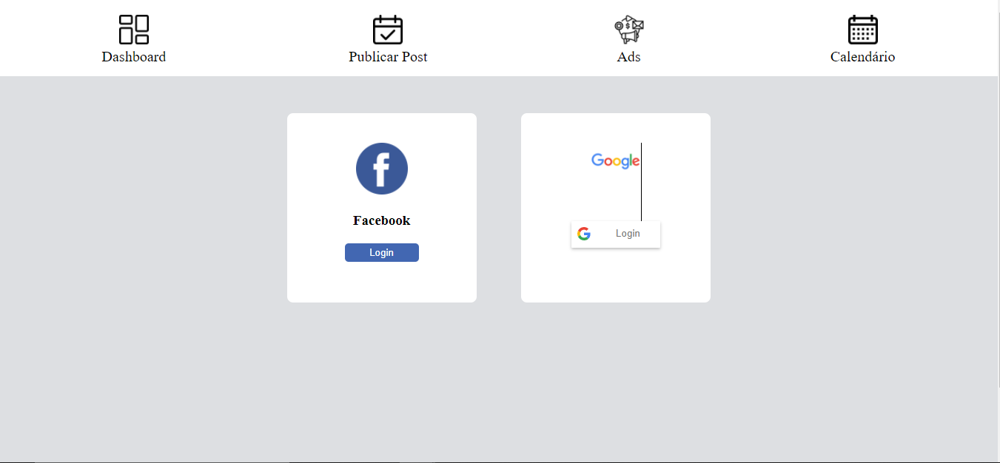

# Template do Site 
O padrão de layout a ser utilizado pelo site tem correspondência ao projeto de Interface elaborado anteriormente, conforme figura 10. 

Figura 10 - Template padrão do site 

O template criado está disponível no link git@github.com:ICEI-PUC-Minas-PMV-ADS/pmv-ads-2021-2-e1-proj-web-t3-gerenciadorredessociais.git e é composto pelos seguintes layouts:  

Cabeçalho: uma barra superior onde estão dispostos elementos fixos de cada seção. 

Conteúdo: vários quadros apresentando em cada um a API da rede social desejada. 

# Tela Principal 

Tela que abrange todos logins de Redes Sociais e um menu superior. 

# Tela de Login do Facebook  

Api de login com facebook. Após clicar em login na rede social Facebook abre esta janela de login. 
