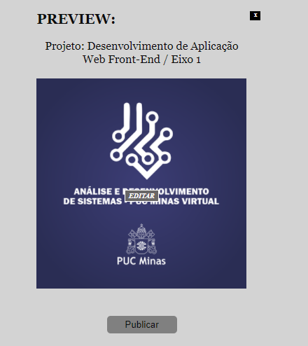

# Registro de Testes de Software
## Tela de Dashboard

* Login com a conta da rede social 

* Login realizado com sucesso, perfil do facebook conectado

## Tela de Publicar Post

* O site deve permitir realizar postagens nas redes sociais. 

O campo "Perfil Conectado" após o login na rede social, deverá trazer a informação da foto do perfil do usuário que foi logado.
 
 
O campo "Selecione a data" deverá ser possível inserir a data da publicação, dia atual.  
 
 
O campo "Descrição" deverá permitir ao usuário escrever a legenda da sua publicação, após isso o usuário deverá clicar no botão “Enviar Texto” para que a descrição seja adicionada ao campo de Preview. 

O campo "Midia" deverá permitir ao usuário anexar a imagem que quer publicar, para isso o usuário deverá clicar em “Escolher arquivo” onde será direcionado á uma pasta para escolher o arquivo desejado.

Após a seleção da mídia, seu nome será preenchido e automaticamente ela será adicionada ao campo de Preview. 

O campo "Preview"irá ser preenchido de acordo com as informações inseridas pelo usuário.

Caso o usuario queira apagar as informações inseridas, basta clicar no "X" no canto superior direito, e todas as informações serão excluidas para começar novamente o ciclo, ao clicar sobre a imagem selecionada irá aparecer o "Editar" que clicando será possivel também fazer a seleção de uma outra midia.

Após definido o Preview o usuario deverá clicar em "Publicar", para que a postagem seja efetuada com sucesso o perfil do usuario deve ter as permissões do Aplicativo Facebook, caso o perfil do usuario não seja permitido a publicação não será efetuada e sistema retornará um alerta de erro.

## Tela do Calendário
- A tela exibe um calendário funcional criado com Javascript, o mesmo realiza a função de sempre exibir a data atual (current date), de forma que o usuário possa se planejar acerca dos dias em que planeja realizar suas postagens.

- O usuário consegue acessá-lo através do header da página principal, ao clicar no icon a página é redirecionada.

**Ele realiza a exibição da data atual de duas formas:**
- Exibindo em seu cabeçalho o mês atual e abaixo do mesmo a data completa no seguinte formato: dia por escrito, dd/mm/aaaa.

- No corpo onde se exibe todos os dias do mês, através de um elemento hover, o dia atual recebe automaticamente uma cor diferente dos outros.

- O usuário é capaz de navegar entre os meses de forma inteligente e responsiva através da seta esquerda ou direita. 

 

 
- A quantidade de dias do mês se adapta de acordo com o mês respectivo, sendo 30 ou 31 dias, ou até mesmo 28 como no caso do mês fevereiro.

  

- O calendário exibe também os últimos ou primeiros dias dos próximos meses, caso os mesmos façam parte da mesma semana de um dos dias do mês atual.

 

- Ao passar o mouse sobre os dias no corpo do calendário, o display muda de forma, recebendo um contorno e aumentando de tamanho para destacar o dia, o cursor do mouse também é alterado, sendo assim o usuário consegue se orientar melhor.

 

## Avaliação

- Para que a ação de publicar post seja finalizada com sucesso, por meio do SDK do Facebook é preciso que o perfil do usuario tenha algumas permissões especificas, no caso do grupo não conseguimos ter todas as permissões necessárias para realizar a publicação, não sendo possivel efetuar a postagem no perfil e então foi retornada uma mensagem de erro.

- As funções do calendário referenciadas no tópico "04 - Projeto de Interface" deste projeto, como: 
*Possuir barras de filtros para exibir:* Status das postagens ("publicado" ou "agendado"), os canais desejados (redes sociais) e o filtro de data por postagens, não foram executadas  devido a impossibilidade de fazer a integração com as redes sociais de forma completa, devido aos erros de permissões já citados no parágrafo anterior.
Logo, essas funções não foram criadas, para que não haja confusão no usuário ao visualizar um recurso sem função e também para respeitar a Restrição de número 2 presente nas especificações do projeto: *"RE-02 - O aplicativo deve se restringir às tecnologias básicas da Web no Frontend".*

> **Links Úteis**:
> - [Ferramentas de Test para Java Script](https://geekflare.com/javascript-unit-testing/)
